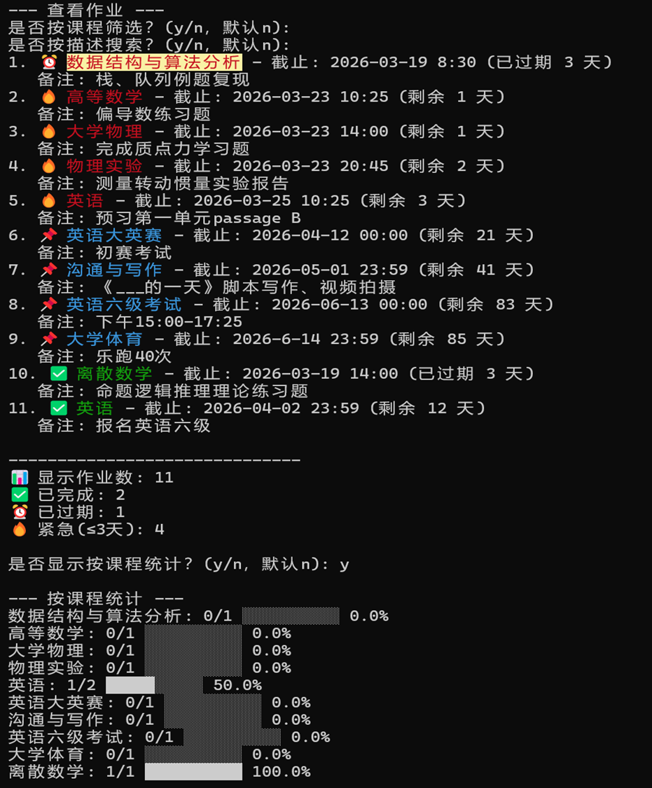
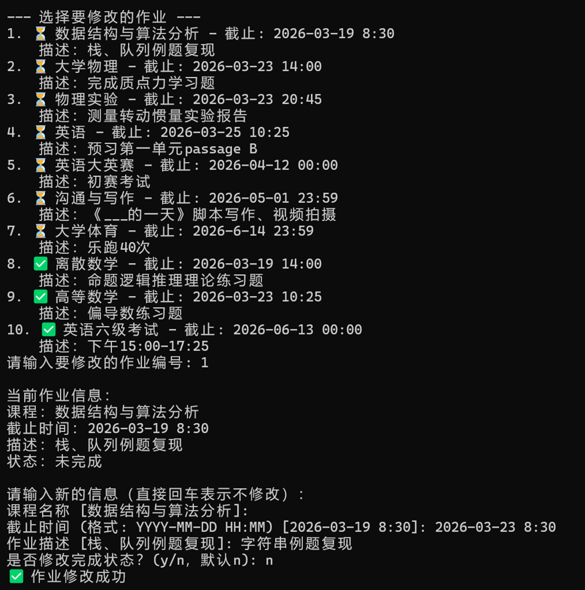
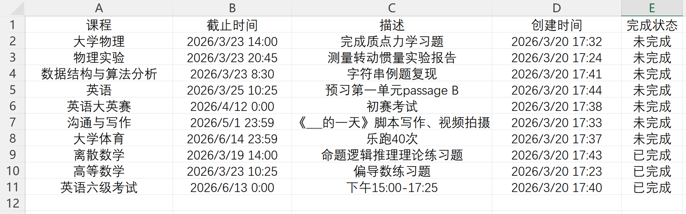

# DDL 管家

> 一款为大学生设计的作业截止时间管理工具，帮你轻松应对多门课程的DDL。

  

## 📖 项目简介

大学课程繁多，各科作业截止时间分散在不同平台，经常忘记提交？  
“DDL管家”是一个简洁的命令行工具，帮助你集中管理所有作业，自动提醒紧急任务，让DDL不再成为烦恼。

**项目特点**：
- 纯命令行交互，启动快速，无复杂界面
- 数据本地存储，自动备份，安全可靠
- 智能模糊搜索，支持拼写纠错
- 彩色输出，紧急程度一目了然
- 支持导出CSV，便于统计分析

## ✨ 功能列表

| 功能 | 说明 |
|------|------|
| ✅ 添加作业 | 输入课程、截止时间、描述（可选），自动校验日期格式 |
| 📋 查看作业 | 按紧急程度彩色显示，支持按课程/描述筛选，自动统计完成情况 |
| 🔍 模糊搜索 | 包含匹配 + 相似度匹配（基于difflib） |
| ✔️ 标记完成 | 一键切换作业状态 |
| ✏️ 修改作业 | 编辑课程、截止时间、描述，甚至切换完成状态 |
| 🗑️ 删除作业 | 二次确认，防止误删 |
| 📤 导出CSV | 将作业列表导出为Excel可打开的CSV文件 |
| 💾 自动备份 | 每次保存时自动备份，文件损坏时自动恢复 |
| 🔔 桌面通知 | 启动时检查今日到期作业，弹出系统提醒（Windows支持） |
| 🎨 彩色界面 | 根据剩余天数自动改变文字颜色，过期作业红底黄字醒目提示 |

## 🛠️ 技术栈

- **语言**：Python 3.8+
- **核心库**：
  - `json` / `os` / `shutil` —— 数据持久化与备份
  - `datetime` —— 日期计算
  - `difflib` —— 模糊匹配
  - `colorama` —— 彩色输出
  - `csv` —— 导出功能
  - `plyer` —— 桌面通知（可选）
- **打包工具**：PyInstaller
- **版本控制**：Git + GitHub

## 🚀 快速开始

### 方式一：直接运行源代码

1. **克隆仓库**
   ```bash
   git clone https://github.com/K-S-K-Ray/DDL_Manager.git
   cd DDL_Manager
   ```

2. **安装依赖**
   ```bash
   pip install -r requirements.txt
   ```
   （`requirements.txt` 内容：`colorama` `plyer`，若不需要桌面通知可忽略 `plyer`）

3. **运行程序**
   ```bash
   python ddl_manager.py
   ```

### 方式二：使用打包好的可执行文件（Windows）

1. 在 [Releases](https://github.com/K-S-K/DDL_Manager/releases) 页面下载最新版的 `DDL管家.exe`。
2. 双击运行即可，无需安装Python环境。

> 注：首次运行会在同目录下自动生成 `tasks.json` 数据文件。

## 📁 项目结构

```
DDL_Manager/
│
├── ddl_manager.py          # 主程序，包含所有功能
├── tasks.json              # 数据存储文件（自动生成）
├── tasks_backup.json       # 备份文件（自动生成）
├── requirements.txt        # 依赖列表
├── README.md               # 项目说明
└── .gitignore              # Git忽略文件
```

**代码分区**：
- 数据操作：`load_tasks` / `save_tasks` / `check_today_tasks`
- 工具函数：日期校验、剩余天数、模糊匹配、排序键
- 任务操作：添加、查看、标记完成、删除、修改、导出
- 主程序入口：`main()`

## 📸 部分截图

> 

## 🔧 开发与打包

### 打包为独立exe（Windows）
```bash
pip install pyinstaller
pyinstaller --onefile --name DDL管家 --hidden-import plyer.platforms.win.notification --hidden-import pywin32 ddl_manager.py
```
生成的exe位于 `dist` 文件夹。

### 参与贡献
欢迎提交Issue或Pull Request，共同完善这个项目。

## 📄 许可证
MIT License


## 🗺️ 未来计划

- [ ] 增加云同步功能（多设备共享）
- [ ] 支持更多排序方式（按课程、按创建时间）
- [ ] 开发简单的图形界面版本（Tkinter / PyQt）
- [ ] 增加课程表导入功能

## 🙏 致谢

- 感谢西电“星火杯”提供的锻炼机会

---

**作者**：刘家瑞 K-S-K 
**GitHub**：[我的主页](https://github.com/K-S-K-Ray)  
**项目地址**：[https://github.com/K-S-K-Ray/DDL_Manager](https://github.com/K-S-K-Ray/DDL_Manager)

---
⭐ 如果这个项目对你有帮助，欢迎点个Star支持一下！